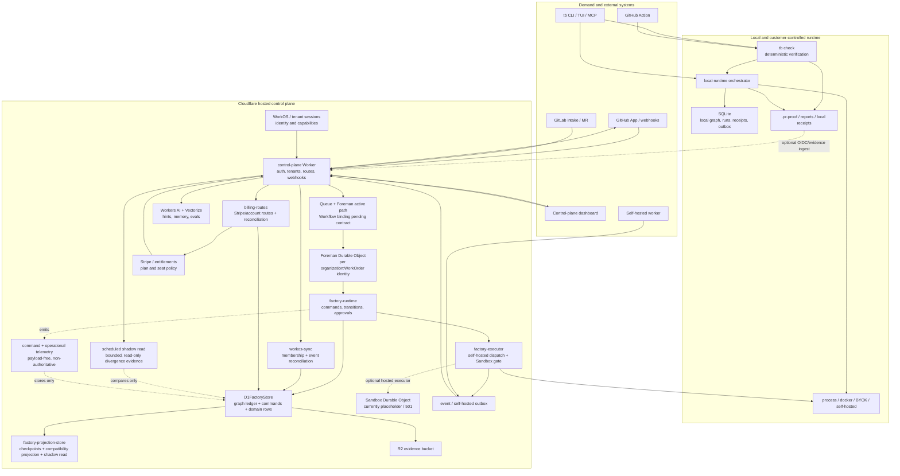

# Tinkerbot Architecture Map

Status: source-level architecture map and remediation baseline; re-audited 2026-08-21, including the Cloudflare Workflow contract.

Hosted closure and differentiation sequencing: [ADR-0011](./adr/0011-hosted-production-closure-and-differentiation-sequencing.md).

Observed on local `main` at `917a11b` (`origin/main` remains `6357d73`), with the current Factory Spine worktree preserved. This document describes the architecture that exists in the repository, distinguishes authoritative state from projections and adapters, and records the remaining gates before the system should be treated as production-authoritative.

## Executive read

Tinkerbot is two tightly coupled products:

1. A deterministic verification and assurance tool centered on `tb check`, which runs on a developer machine, a customer-controlled runner, or GitHub Actions.
2. A Factory control plane centered on WorkOrders, the Factory Graph, and Foreman, which coordinates demand, execution, evidence, review, release, and outcome.

The intended direction is sound: execution is pluggable, `tb check` owns verification truth, and the Factory Graph owns lifecycle truth. The local and hosted WorkOrder creation paths now use one typed admission command, and the CLI/MCP dependency cycle is removed. The remaining risks are making the canonical-tree cleanup durable in `main`, missing staging/production proof, and a dashboard/Worker surface that is still larger than the underlying domain model even after extracting executor, Foreman admission/decision routing, bounded request parsing, scheduled maintenance, WorkOS synchronization, billing route, tenant authorization and routes, hosted assurance, provider intake routes, GitHub integration, D1 projection, telemetry, workspace metadata, factory definition persistence, graph-derived read models, run/evidence/cost artifacts, Factory operations metadata, hosted D1 storage, evidence, and provider protocol boundaries. The hosted Sandbox is intentionally feature-gated rather than an unresolved executor choice. One platform contract is still open: `FACTORY_RUN` is declared in Wrangler, but the current `FactoryRunWorkflow` is not an official `WorkflowEntrypoint`/`step` implementation and no production path calls `FACTORY_RUN.create`; Queue → Foreman is the active hosted coordination path until that binding is repaired or removed.

The durable target is:

```text
external demand
      |
      v
intake adapter -> command boundary -> Foreman (one WorkOrder authority)
                                      |
                 +--------------------+--------------------+
                 |                    |                    |
                 v                    v                    v
          append graph event    dispatch executor     append receipt/evidence
                 |                    |                    |
                 +--------------------+--------------------+
                                      v
                         projections / views / outbox
```

`tb check` remains the verification authority inside that flow. Intelligence can advise, but it cannot publish the verification verdict or silently advance lifecycle state.

## Audit snapshot

| Area | Observed state | Interpretation |
| --- | --- | --- |
| Canonical source | Local `main` at `917a11b`; `origin/main` at `6357d73`; the current tree cleanup is staged but not committed | `main` is the intended release source, but a fresh checkout does not yet reproduce the cleaned tree |
| Factory spine | Typed WorkOrder admission, command receipts, aggregate ordering, replayable graph projections, transition contract, route contracts, shadow-read sweep, and payload-free command telemetry are implemented; Foreman admission/decision routing, bounded request parsing, scheduled maintenance, and D1 projection/checkpoint/shadow concerns now have dedicated adapters | Application-level authority cutover is locally complete |
| Local verification | `tb check` and the assurance packages remain the deterministic verification boundary | Factory, agents, integrations, and AI may request or carry evidence; they cannot manufacture a verdict |
| Local quality evidence | 53 test files / 337 tests pass; typecheck, source/factory/migration/schema gates, diff check, release dry-run, and local release-gate report pass | The source-level implementation is internally consistent in this worktree |
| Hosted proof | Self-hosted dispatch/completion is implemented and signed; no complete real hosted lifecycle or staging shadow-read soak is recorded | Production authority remains unaccepted until environment evidence exists |
| Known capability gap | Cloudflare Sandbox binding is present but returns `501`; unsupported dispatch fails closed with a graph-visible block | Sandbox stays feature-gated; self-hosted is the selected hosted executor |

The map below separates four kinds of edges: commands that can change authority, execution that can produce evidence, projections that can be rebuilt, and integrations that publish or ingest external state. That separation is the main architectural invariant.

## Conceptual product hierarchy

```text
Organization
  └─ Portfolio
      └─ Product
          └─ Factory
              └─ Production line
                  └─ Work cell
                      └─ Work order
                          └─ Run
                              └─ Stage
                                  └─ Evidence
                                      └─ Decision
                                          └─ Release / Outcome
```

The hierarchy is a product model rather than one database table chain. The durable implementation is distributed across Factory definitions, WorkOrder/run/stage records, graph events, evidence stores, and compatibility projections.

## Runtime topology



### What each edge means

- GitHub and GitLab are demand and publication adapters. They do not own Factory lifecycle state.
- The GitHub Action runs `tb check` on the customer runner. It may publish a Check Run/comment and may submit OIDC-authenticated evidence, but it does not replace the local verification engine.
- The CLI and TUI are clients. Local `tb factory`, `tb work`, and related commands use the local runtime and SQLite; hosted commands use the control-plane API.
- The Worker is an HTTP/authentication and integration boundary. It should delegate lifecycle mutations to Foreman rather than becoming a second state machine. OAuth, session refresh, organization selection, membership reconciliation, invitations, and sign-out live in the `tenant-routes` adapter; hosted assurance validation, receipt binding, evidence publication, and verification reconciliation live in the `assurance-routes` adapter; provider webhook admission, GitHub/WorkOS installation callbacks, and integration command dispatch live in the `integration-routes` adapter; the serialized Durable Object admission/decision surface lives in `foreman-routes`; bounded JSON admission is shared by `factory-request`; scheduled Factory OS cleanup lives in `factory-maintenance`; WorkOS membership, SCIM, and Events API reconciliation live in the `workos-sync` boundary; billing provider/account routes and scheduled seat reconciliation live in `billing-routes`; neither boundary writes Factory lifecycle events.
- Foreman serializes WorkOrder commands. The Factory command spine supplies idempotency, command fingerprints, aggregate sequence numbers, receipts, and legal transition checks.
- The active hosted delivery path is Queue → Foreman → `factory-runtime`. The configured `FACTORY_RUN` Workflow binding is not counted as active: its current class does not extend Cloudflare's `WorkflowEntrypoint`, does not receive a `WorkflowStep`, and has no `step.do` execution boundary. It must be implemented against the platform contract or removed from the deployment shape before it is treated as a production dependency.
- D1 and SQLite are storage adapters. The graph event ledger is intended to be the lifecycle source of truth; status, stage, actor, and decision columns are compatibility projections. In hosted D1, `factory-store` remains the Factory façade and command-boundary owner; `factory-graph-store` owns graph event/outbox/receipt/replay persistence while `factory-projection-store` owns checkpointing, compatibility refresh, typed decision recording, and read-only shadow audits. `factory-artifact-store` owns run/evidence/cost/execution-plan/token/publication/evaluation persistence, and `factory-operations-store` owns cells, products, skills, proposals, releases, deployments, outcomes, scorers, and self-improvement metadata; neither adapter appends graph events.
- R2 stores larger evidence payloads. Vectorize and Workers AI provide memory, hints, and evaluation support; they are not verdict authorities.
- WorkOS/tenant sessions and Stripe/entitlement state authorize access and capacity; neither is a Factory lifecycle writer.
- The scheduled shadow read compares graph-derived state with compatibility projections without repairing either side. Command telemetry is bounded, payload-free, discardable evidence; it cannot affect a command result.
- The hosted Sandbox binding exists in the deployment shape, but its current implementation returns `501` and is not an executable production capability. When no executable Sandbox binding is present, the Worker fails the WorkOrder closed with a graph-visible `task.blocked` event and `executor_unavailable` result instead of leaving it waiting indefinitely. Self-hosted execution is the selected hosted execution contract today.

## Authority planes

ADR-0009 defines four deliberately disjoint planes. ADR-0010 makes the Factory Graph and Foreman the durable lifecycle spine that connects them without collapsing their responsibilities.

| Plane | Owns | May not own |
| --- | --- | --- |
| Control | WorkOrders, definitions, recipes, cells, identity, entitlements, legal lifecycle transitions | Verification verdicts or arbitrary executor claims |
| Execution | Processes, sandboxes, customer terminals, CI, self-hosted workers, provider logs | Lifecycle authority or final verification truth |
| Assurance | `tb check` verification verdict, receipts, evidence contracts, inspection results | Factory stage transitions, release authorization, intelligence recommendations |
| Intelligence | Hints, evals, prioritization, Steward proposals, memory retrieval | Verification verdicts, approvals, releases, or silent state mutation |

The human and the source-control provider remain part of the release boundary: a Factory release decision can authorize a release candidate, but repository merge and provider-side deployment permissions still have their own authority.

## Lifecycle and event path

```text
1. Demand arrives from GitHub, GitLab, CLI, MCP, dashboard, or an automation.
2. An intake adapter establishes organization/source identity and an idempotency key.
3. Foreman accepts a WorkOrder command under the per-WorkOrder serialization boundary.
4. The command spine validates the transition, fingerprints the payload, assigns sequence, and records a receipt.
5. A graph event is appended; a compatibility projection is refreshed.
6. A plan selects cells and stages; an executor is dispatched through the runtime capability matrix.
7. The executor returns logs, artifacts, and receipts. Hosted self-hosted work returns through the outbox.
8. `tb check` produces the verification verdict and evidence. The hosted plane may ingest that result, but may not manufacture it.
9. Review, approval, release, rollback, and outcome commands append typed graph events.
10. D1/SQLite projections, API views, dashboard views, reports, and provider publications consume the durable state.
```

WorkOrder initialization now uses `admitWorkOrder` in the local SQLite store, hosted D1 store, local orchestrator, hosted runtime, CLI, and MCP path. The row insert, `work_order.created` event, command receipt, outbox, and projection are assembled through the adapter command unit; `seedWorkOrder` is reserved for tests and migration fixtures. This closes the last known application-level creation seam, but does not by itself satisfy the external shadow-read or hosted lifecycle proof gates.

## Repository component map

### Product and application surfaces

| Surface | Location | Responsibility |
| --- | --- | --- |
| Public CLI | `packages/cli` | `tb check`, factory/work/run commands, auth, reports, doctor, hosted/local dispatch |
| Terminal session | `packages/tui` | Master tabs, PTY/session chrome, nested CLIs, workstation interactions |
| GitHub Action | `action` and `action.yml` | Customer-run verification, reports, OIDC evidence, Check Runs, sticky comments |
| GitHub App | `github-app` | Manifest and protocol boundary for GitHub integration |
| Hosted dashboard | `apps/control-plane` | Static browser application and API-facing views; local in-memory backend is fixture-only and production-mode static serving rejects it |
| Hosted Worker | `apps/control-plane-worker` | HTTP routes, auth, webhooks, billing, Factory orchestration, queue/workflow consumers; delegates executor, identity, billing, and projection boundaries |

### Core verification and assurance packages

| Package group | Packages | Architectural role |
| --- | --- | --- |
| Foundation | `core`, `git`, `parser`, `language-core`, `language-validation` | Shared types/config, repository revisions, language/source model, parsing and validation |
| Change analysis | `coverage`, `selection`, `impact-analysis`, `mutation`, `test-integrity`, `baseline` | Changed-line coverage, scope selection, impact, mutation, test quality, finding state |
| Policy and evidence | `policy`, `contracts`, `provenance`, `artifacts`, `fixtures`, `history` | Policy packs, consumer/API contracts, evidence lineage, artifact loading, fixtures, local history |
| Outputs | `reporters` | Terminal, JSON, Markdown, SARIF, review context, receipts, and evidence output |
| Assurance | `assurance` | Receipts, admission, change/verification contracts, evidence graphs, agent/release/outcome records |

### Factory, runtime, integration, and interface packages

| Package group | Packages | Architectural role |
| --- | --- | --- |
| Factory control | `factory`, `control-plane` | Factory definitions, graph events, command spine, transitions, approvals, authority, runtime profiles, entitlements, roles, billing contracts |
| Runtime | `local-runtime` | SQLite persistence, local orchestration, sandbox ports, BYOK providers, self-hosted harness, outbox, local views |
| Hosted integrations | `hosted-integrations`, `github`, `gitlab` | WorkOS and Stripe protocol clients, D1/R2/session adapters, webhook ledgers, GitHub/GitLab intake and publication; D1 persistence is isolated in `hosted-integrations/src/d1-stores.ts` and evidence transport in `hosted-integrations/src/evidence-store.ts` |
| Protocol/client | `platform-mcp` | Stdio/platform MCP server and Factory/local context tools |
| Interfaces | `design-system` | Shared browser styling and UI primitives |

The dependency shape is intentionally layered:

```text
core
  -> language / git / analysis / policy / assurance / reporting packages
factory -> core
local-runtime -> factory
platform-mcp -> factory + local-runtime/factory-operations
cli -> most local packages + platform-mcp + tui
hosted Worker -> factory + assurance + hosted-integrations + control-plane + GitHub/GitLab adapters
```

The former `cli -> platform-mcp -> cli` cycle is closed. Shared local Factory operations live in `packages/local-runtime/src/factory-operations.ts`; MCP and CLI both consume that lower-level module, while only the CLI entrypoint dispatches into the MCP transport.

## State and storage map

| State or artifact | Local authority | Hosted authority | Consumers |
| --- | --- | --- | --- |
| Verification verdict | `tb check` and assurance receipt | OIDC/evidence ingest of the customer-run result | Factory verification event, reports, Check Run, dashboard |
| Lifecycle status/stage/actor | Factory Graph through local runtime | Factory Graph through Foreman and D1 | Projections, API views, dashboard, outbox |
| Command idempotency and ordering | SQLite command receipts/graph tables | D1 command receipts, aggregate sequence, graph events | Retry handling, reconciliation, audit |
| Command and operational telemetry | bounded in-process records plus SQLite command telemetry | payload-free D1 command ledger plus typed operational-signal ledger | Operator evidence, latency/failure analysis, delivery/SLO analysis; never lifecycle authority |
| WorkOrder/run/stage metadata | SQLite | D1 | Planner, executor, views, reports |
| Evidence payload | `.pr-proof`, local artifacts | R2 payload plus D1 metadata/graph reference | Assurance, reports, release/outcome records |
| Factory definitions | `.tinkerbot` source and local definitions | Hosted Factory definition records/digests | Planner, cells, dashboard, audits |
| Identity and entitlements | Local config/auth context | WorkOS, session store, Stripe/billing contracts | Worker route authorization and capability matrix |
| Intelligence memory | Local provider/eval context | Workers AI/Vectorize | Suggestions and Steward proposals only |
| Publication | Local report files or Action | GitHub/GitLab APIs and hosted publication routes | Reviewers and repository history |

The storage rule should remain: append the durable graph event first, then update or rebuild projections. A projection must be disposable and replayable. API and UI code should not infer lifecycle truth from mutable compatibility columns when an event stream or replayed view is available.

## Runtime and deployment matrix

| Runtime | Execution location | Durable state | Current status |
| --- | --- | --- | --- |
| Local verification | Developer/customer machine | Files, `.pr-proof`, optional SQLite | Primary deterministic verification path |
| GitHub Action | Customer GitHub runner | Uploaded artifacts and optional hosted evidence | Supported integration; fork PR writes are restricted |
| Local Factory | Developer/customer machine | SQLite graph, receipts, runs, outbox | Supported local orchestration path |
| Hosted Factory | Cloudflare Worker + Queue + Foreman DO; Workflow binding declared but not active | D1 graph/projections/receipts, R2 evidence | Queue/Foreman control path implemented; Workflow contract and staging proof remain required |
| Self-hosted hosted execution | Customer worker/terminal | Outbox plus hosted graph receipt | Usable hosted executor path |
| Cloudflare Sandbox | Cloudflare Durable Object binding | Intended hosted execution state | Feature-gated/incomplete: current class returns `501`; unsupported dispatch fails closed |
| Browser dashboard | Static asset served by Worker or local server | None; API/projection client | Useful surface, but must remain projection-driven |

The Wrangler shape also includes AI, Vectorize, Browser, D1, R2, two queues, two Durable Objects, a declared Workflow, cron, and environment-specific bindings. The Workflow declaration is currently configuration-only and does not participate in the active queue path; either implement its official entrypoint/step contract or remove the binding until it has a real caller. Staging and production configuration still contain placeholder-style resource identifiers and therefore need operator provisioning evidence before release claims are made.

### Execution capability matrix

| Requested capability | Local control plane | Hosted control plane | Authority consequence |
| --- | --- | --- | --- |
| Process or Docker runner | Allowed through the local runtime sandbox boundary | Rejected at runtime-profile validation | Customer execution produces evidence; it never writes lifecycle state directly |
| Managed inference | Local provider selection or stub | Workers AI through the configured gateway | AI output is advisory and usage is recorded separately from verification |
| BYOK or local inference | Local provider boundary | Only through a customer-owned self-hosted worker | Provider credentials do not cross the hosted command boundary |
| Self-hosted implementation | Local harness or customer worker | Signed dispatch through queue/HTTPS bridge, then signed completion back through Foreman | Completion is an attested input to a command, not an event append authority |
| Cloudflare Sandbox | Local stub/Docker analogue only | Feature-gated; current binding returns `501` | Unsupported execution blocks visibly instead of creating an indefinite wait |
| Deterministic verification | `tb check` on the developer/customer runner | OIDC/evidence ingest of the customer-run result | Only the Assurance plane can publish `PASS`, `FAIL`, or `UNKNOWN` |

## Branch and source-of-truth map

At the time of this audit, local `main` points to `917a11b` and `origin/main` points to `6357d73`; `main` remains the canonical release source. The canonical-tree cleanup is staged in the current index but not committed, so a fresh-checkout claim still requires the review/commit step. The branch and worktree provenance is recorded in the [branch/source inventory](./repo-hygiene/branch-source-inventory.md). The local branch refs show parallel historical product work:

| Branch | Relationship to `main` | Meaning |
| --- | --- | --- |
| `main` | Canonical | Current integration and release source |
| `codex/release-source-recovery` | Behind; no unique commits relative to `main` | Recovery branch whose changes are already represented in `main` |
| `codex/software-factory-ux` | One unique commit ahead and substantially behind | Older Factory UX slice with a separate worktree; requires selective triage, not direct release |
| `codex/webui` | Five unique commits ahead and substantially behind | Older Web UI/TUI slice; contains parallel architecture/UI history |

The older branches contain a conceptual `docs/architecture.md` map, but `main` is the canonical source. Unique branch changes should be cherry-picked or discarded deliberately and then the branches should be archived or rebased. Parallel architecture documents and duplicate source artifacts make it difficult to tell whether a behavior is current, transitional, or abandoned.

## Operational and release map

The release path is:

```text
source tree
  -> pnpm install/build/typecheck
  -> Vitest package and integration suite
  -> GitHub Action matrix (Linux / macOS / Windows)
  -> release client/manifests/Homebrew/npm/Bun artifacts
  -> hosted provisioning and provider validation
  -> signed/reproducible release artifacts
```

Current repository evidence is mixed but materially improved:

- The local suite is green after the Factory Spine work: 53 files and 337 tests passed.
- `git diff --check` passes.
- The current working tree passes `pnpm typecheck`, `pnpm verify:source-tree`, `pnpm verify:factory-tree`, `pnpm verify:migrations`, and `pnpm verify:schema-contract`; the verifier runs before build/typecheck and ignores only the durable quarantine inventory.
- `pnpm release:dry-run` passes and produces a 247-file package after numeric-suffix and generated-artifact filtering.
- The duplicate cleanup is represented in the current staged index and quarantine inventory, but not in a commit, so a fresh checkout from `917a11b` still contains the historical duplicate paths until that cleanup is reviewed and committed.
- Release manifest documentation still records artifact signing as false until CI signing is implemented.
- The hosted Sandbox still returns `501` and is explicitly unsupported; unsupported dispatch now fails closed with a graph-visible block. An opt-in scheduled D1 shadow-read sweep now emits bounded, read-only divergence evidence, but no staging soak or complete hosted self-hosted lifecycle proof has been recorded.
- These remaining items are source-tree and release-readiness gates, not evidence that the local Factory lifecycle logic is incorrect; they do mean the repository is not presently clean enough to make a strong production-authority claim.

## Open gates before production authority

The application-level spine is implemented, but these gates remain open:

1. Repair `FactoryRunWorkflow` to extend the official Cloudflare Workflow entrypoint and execute the queue payload inside a durable `step.do` boundary, or remove the unused Workflow binding and document Queue → Foreman as the sole hosted delivery path.
2. Review and commit the staged canonical-tree cleanup, then run typecheck, tree verification, and the release dry-run from a fresh checkout.
3. Provision real staging resources, apply migrations `0001`–`0024`, and run the scheduled shadow-read/replay soak with zero unexplained divergence.
4. Prove one complete hosted self-hosted lifecycle: admission → dispatch → signed completion → deterministic `tb check`/OIDC ingest → reconciliation and publication.
5. Exercise queue redelivery, Foreman restart, projection retry, duplicate commands, out-of-order completion, and release-approval reference validation against staging resources.
6. Provision WorkOS, Stripe, Cloudflare, CI, and signing identities; record live provider, CI, and signed-artifact evidence.
7. Reconcile or archive the divergent historical branches/worktrees so `main` is the sole release source.

None of these gates is closed by a green local test suite alone. They are environment, provenance, or release-evidence gates and should remain explicit in the ADR and release checklist.

## Priority recommendations

### P0 — close the Cloudflare Workflow contract

The current source-level tests exercise the legacy convenience shape of
`FactoryRunWorkflow`, but Cloudflare's deployed Workflow contract requires a
`WorkflowEntrypoint<Env, Params>` subclass whose `run` method receives a
`WorkflowEvent` and `WorkflowStep`, with work performed through at least one
durable step. The repository currently has no `FACTORY_RUN.create` caller, so
the safe choices are explicit:

1. Implement the Workflow as a real durable adapter around the same typed
   `routeFactoryQueueMessage`/Foreman command path, using a named `step.do`
   boundary and `this.env`; add a Worker-runtime smoke test that exercises the
   actual entrypoint shape.
2. If Queue → Foreman is the only intended hosted path, remove the unused
   Workflow binding and its compatibility class until a real Workflow use case
   is approved.

Do not count a successful local TypeScript/test run or `wrangler --dry-run` as
proof of this platform contract; both can miss runtime entrypoint semantics.

### P0 — make the canonical source tree durable

1. Keep the existing duplicate inventory as the audit record, then commit the reviewed canonical-tree cleanup and quarantine. Do not delete files solely because their names look duplicated; establish provenance and retain a recoverable archive.
2. Keep the canonical-path check before TypeScript compilation and packaging. Ensure generated previews, copied assets, and alternate experiments live outside the compiler/package globs.
3. Remove repeated `.gitignore` allowlist blocks and define one explicit policy for `.tinkerbot` source, generated artifacts, and worktree imports.

Acceptance evidence: clean `pnpm typecheck`, clean `pnpm verify:factory-tree`, no duplicate semantic paths, and a release build from a fresh checkout.

### P0 — prove the Factory authority cutover

1. Keep the canonical admission command as the only application WorkOrder creation path; `seedWorkOrder` remains fixture/migration-only.
2. Keep all later transitions, approvals, cell holds, verification ingestion, self-hosted completion, and release/outcome changes behind Foreman/`FactoryCommandBoundary`.
3. Run the opt-in scheduled shadow-read/replay sweep against staging; it compares graph-derived state with compatibility projections and reports divergence without mutating production state.
4. Exercise retries, duplicate commands, queue redelivery, DO restart, projection retry, out-of-order self-hosted completion, and release approval reference validation in hosted staging.

Acceptance evidence: replayable graph history, zero projection divergence in a staging lifecycle, idempotency tests across retries, and a documented rollback/reconciliation procedure.

### P0 — decide the hosted execution contract

Decision: self-hosted/GitHub Actions is the supported hosted execution contract.
The hosted Sandbox remains feature-gated and is not a production capability claim
until its executor is implemented and staged.

This decision is final for the current release line: do not enable
`cloudflare_sandbox` for hosted production runs. A future Sandbox implementation
requires a separate ADR/amendment covering isolation, limits, artifact capture,
cancellation, failure recovery, and stage proof; it is not an alternate path to
close the current release gate.

Acceptance evidence: a real end-to-end hosted run, with executor capability, evidence capture, and failure semantics visible in the Factory Graph.

### P1 — make remaining boundaries enforceable

- Keep `platform-mcp` below the CLI dispatcher; shared local Factory operations now live in `local-runtime/factory-operations` and should remain transport-neutral.
- Generate and commit the Worker binding declaration with the existing `apps/control-plane-worker` `types` script, then replace the hand-written `Env`/`FactoryEnv` split with the generated `Env` plus narrow adapter contracts. Type the Worker export against the platform `ExportedHandler`/`MessageBatch`/`ScheduledController` shapes so config drift is caught before deployment.
- Replace the remaining internal `as unknown as` Foreman command casts with runtime-narrowed discriminated command payloads. The current bounded parser limits size, but size bounds alone do not prove that a queue/workflow payload is a valid Factory command.
- Continue splitting the large Worker (~939 lines) and D1 Factory façade (~635) by domain. Provider webhook admission, installation callbacks, and integration command dispatch now sit in a dedicated ~275-line route adapter; graph event/outbox/command-receipt/replay persistence now sits in a dedicated ~142-line graph adapter; factory definition validation/digest/version persistence now sits in a dedicated ~86-line definition adapter; OAuth/session/tenant routes sit in a dedicated ~236-line adapter; hosted assurance validation/receipt binding/evidence publication/reconciliation sits in a dedicated ~238-line adapter; and signed self-hosted completion and graph resume sit in a dedicated ~133-line route adapter. Workspace metadata now sits in a dedicated ~55-line adapter, graph-derived operator/WorkOrder views now sit in a dedicated ~142-line read-model adapter, run/evidence/cost/execution-plan/token/publication/evaluation persistence now sits in a dedicated ~171-line artifact adapter, and Factory cells/products/skills/proposals/releases/deployments/outcomes/scorers/self-improvement metadata now sits in a dedicated ~135-line operations adapter. The hosted integration facade is now a ~362-line contract/configuration surface with dedicated provider-core (~42), WorkOS (~274), Stripe (~162), hosted D1 (~345), and evidence (~80) adapters. GitHub intake persistence and verification publication sit in a dedicated ~79-line Worker adapter. Tenant session/capability authorization now sits in a dedicated ~149-line boundary. D1 projection/checkpoint/shadow concerns now sit in a dedicated ~211-line adapter, and D1 command/operational telemetry sits in a dedicated adapter. Billing is isolated in a dedicated ~201-line route/reconciliation module; Foreman admission/typed decisions now sit in a dedicated ~165-line adapter, bounded JSON parsing in a ~37-line request boundary, and scheduled Factory OS maintenance in a ~50-line adapter; the Factory runtime is now ~655 lines with dedicated ~114-line executor and ~172-line WorkOS synchronization modules. Continue the same boundary discipline for the remaining large HTTP route dispatcher and read-model concerns. This is not a reason to reopen the lifecycle authority decision; it is the next maintainability boundary.
- Typed WorkOrder list/detail/graph/mutation route contracts now sit in `packages/factory/src/route-contract.ts`; the Worker produces the core read responses, decision/steer acknowledgements, and CLI/TUI clients validate them. Remaining UI/MCP surface expansion must consume these contracts rather than add ad hoc response shapes.
- The local dashboard server now treats its in-memory dataset as an explicit preview fixture: `CONTROL_PLANE_MODE=production` serves the shell but rejects API calls with `preview_backend_disabled`. Keep hosted production pointed at Worker graph-derived projections and do not promote the fixture backend.
- Runtime runner/provider aliases now normalize in `packages/factory/src/runtime.ts`, and `runtimeCapabilityDecision` exposes typed capability codes; keep extending the capability matrix as new providers or execution boundaries are introduced. Unsupported combinations must continue to fail at admission or execution with a typed reason.

### P2 — harden data, operations, and release

- `scripts/verify-schema-contract.mjs` now checks SQLite/D1 graph, command, receipt, checkpoint columns and supporting tenant, ordering, idempotency, and retry indexes; migration numbering is also verified as a single ordered sequence. Runtime foreign-key/invariant and deployed replay/checkpoint metrics remain operational hardening work.
- Factory command telemetry now records correlation ID, idempotency outcome, receipt latency, event/projection counts, and failure code without payload data across async and synchronous command paths. The operational signal contract covers queue delivery, Foreman coordination, shadow reads, self-hosted dispatch/completion, verification ingest, provider webhooks, and telemetry retention. D1 now retains both command and operational ledgers in discardable, non-authoritative tables with bounded cleanup; deployed sink/SLO evidence remains operational work.
- `pnpm verify:release-gates` now emits a repeatable local proof report with an explicit `local_pass_external_pending` state, so local integrity cannot be mistaken for staging or provider authority.
- Expand coverage around Factory stores, hosted route adapters, projection replay, TUI boundaries, and release-manifest generation; document intentional coverage exclusions.
- Finish artifact signing and verify the provisioned staging/production resource IDs before publishing release readiness.
- Treat `main` as the only release source; reconcile or archive the parallel branches and keep one canonical architecture document linked from `docs/README.md`.

## Recommended delivery sequence

```text
Wave 1: source hygiene and release gates
  duplicate inventory -> staged/reviewed canonical tree -> committed canonical tree -> fresh-checkout build

Wave 2: platform and lifecycle authority
  Workflow contract decision -> canonical admission command (implemented) -> projection replay/shadow read -> retry/reconciliation proof

Wave 3: execution and API boundaries
  Sandbox decision -> executor contract -> typed route contracts/telemetry -> Worker/store decomposition

Wave 4: operational hardening
  schema conformance -> observability/SLOs -> artifact signing -> branch/archive cleanup
```

The architecture is therefore viable as a durable spine, and the application-level authority cutover is implemented and locally verified. It should still be described as “Factory Graph and Foreman authority awaiting Workflow-contract and production proof,” not as a fully accepted production authority. The highest leverage is to resolve the unused Workflow binding, commit the canonical tree cleanup, run the shadow-read soak, and prove one complete hosted lifecycle with the supported executor before adding more Factory differentiation.
