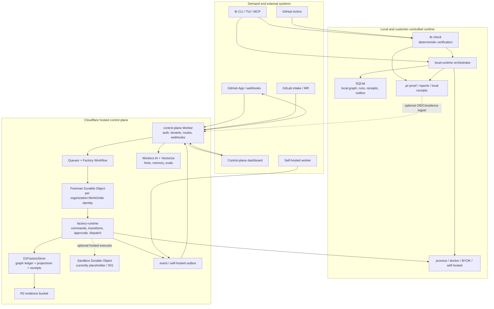

# Tinkerbot Architecture Map

Status: source-level architecture map and remediation baseline.

Observed on local `main` at `6357d73`, with the current uncommitted Factory Spine worktree preserved. This document describes the architecture that exists in the repository, distinguishes authoritative state from projections and adapters, and records the main gaps before the system should be treated as production-authoritative.

## Executive read

Tinkerbot is two tightly coupled products:

1. A deterministic verification and assurance tool centered on `tb check`, which runs on a developer machine, a customer-controlled runner, or GitHub Actions.
2. A Factory control plane centered on WorkOrders, the Factory Graph, and Foreman, which coordinates demand, execution, evidence, review, release, and outcome.

The intended direction is sound: execution is pluggable, `tb check` owns verification truth, and the Factory Graph owns lifecycle truth. The implementation is not fully cut over yet. The primary risks are source-tree duplication, a remaining direct-write seam during WorkOrder creation, an incomplete hosted Sandbox executor, a package dependency cycle, and a dashboard/hosted surface that is larger and less modular than the underlying domain model.

The durable target is:

```text
external demand
      |
      v
intake adapter -> command boundary -> Foreman (one WorkOrder authority)
                                      |
                 +--------------------+--------------------+
                 |                    |                    |
                 v                    v                    v
          append graph event    dispatch executor     append receipt/evidence
                 |                    |                    |
                 +--------------------+--------------------+
                                      v
                         projections / views / outbox
```

`tb check` remains the verification authority inside that flow. Intelligence can advise, but it cannot publish the verification verdict or silently advance lifecycle state.

## Conceptual product hierarchy

```text
Organization
  └─ Portfolio
      └─ Product
          └─ Factory
              └─ Production line
                  └─ Work cell
                      └─ Work order
                          └─ Run
                              └─ Stage
                                  └─ Evidence
                                      └─ Decision
                                          └─ Release / Outcome
```

The hierarchy is a product model rather than one database table chain. The durable implementation is distributed across Factory definitions, WorkOrder/run/stage records, graph events, evidence stores, and compatibility projections.

## Runtime topology



### What each edge means

- GitHub and GitLab are demand and publication adapters. They do not own Factory lifecycle state.
- The GitHub Action runs `tb check` on the customer runner. It may publish a Check Run/comment and may submit OIDC-authenticated evidence, but it does not replace the local verification engine.
- The CLI and TUI are clients. Local `tb factory`, `tb work`, and related commands use the local runtime and SQLite; hosted commands use the control-plane API.
- The Worker is an HTTP/authentication and integration boundary. It should delegate lifecycle mutations to Foreman rather than becoming a second state machine.
- Foreman serializes WorkOrder commands. The Factory command spine supplies idempotency, command fingerprints, aggregate sequence numbers, receipts, and legal transition checks.
- D1 and SQLite are storage adapters. The graph event ledger is intended to be the lifecycle source of truth; status, stage, actor, and decision columns are compatibility projections.
- R2 stores larger evidence payloads. Vectorize and Workers AI provide memory, hints, and evaluation support; they are not verdict authorities.
- The hosted Sandbox binding exists in the deployment shape, but its current implementation returns `501`. Self-hosted execution is the complete hosted execution path today.

## Authority planes

ADR-0009 defines four deliberately disjoint planes. ADR-0010 makes the Factory Graph and Foreman the durable lifecycle spine that connects them without collapsing their responsibilities.

| Plane | Owns | May not own |
| --- | --- | --- |
| Control | WorkOrders, definitions, recipes, cells, identity, entitlements, legal lifecycle transitions | Verification verdicts or arbitrary executor claims |
| Execution | Processes, sandboxes, customer terminals, CI, self-hosted workers, provider logs | Lifecycle authority or final verification truth |
| Assurance | `tb check` verification verdict, receipts, evidence contracts, inspection results | Factory stage transitions, release authorization, intelligence recommendations |
| Intelligence | Hints, evals, prioritization, Steward proposals, memory retrieval | Verification verdicts, approvals, releases, or silent state mutation |

The human and the source-control provider remain part of the release boundary: a Factory release decision can authorize a release candidate, but repository merge and provider-side deployment permissions still have their own authority.

## Lifecycle and event path

```text
1. Demand arrives from GitHub, GitLab, CLI, MCP, dashboard, or an automation.
2. An intake adapter establishes organization/source identity and an idempotency key.
3. Foreman accepts a WorkOrder command under the per-WorkOrder serialization boundary.
4. The command spine validates the transition, fingerprints the payload, assigns sequence, and records a receipt.
5. A graph event is appended; a compatibility projection is refreshed.
6. A plan selects cells and stages; an executor is dispatched through the runtime capability matrix.
7. The executor returns logs, artifacts, and receipts. Hosted self-hosted work returns through the outbox.
8. `tb check` produces the verification verdict and evidence. The hosted plane may ingest that result, but may not manufacture it.
9. Review, approval, release, rollback, and outcome commands append typed graph events.
10. D1/SQLite projections, API views, dashboard views, reports, and provider publications consume the durable state.
```

The main remaining authority seam is WorkOrder initialization: both the hosted D1 store and local orchestrator still populate initial lifecycle columns while also appending `work_order.created`. That is safe only while those columns are treated as compatibility projections and the creation path remains equivalent to the command boundary. It should be converted to one canonical admission command before accepting ADR-0010 as fully implemented.

## Repository component map

### Product and application surfaces

| Surface | Location | Responsibility |
| --- | --- | --- |
| Public CLI | `packages/cli` | `tb check`, factory/work/run commands, auth, reports, doctor, hosted/local dispatch |
| Terminal session | `packages/tui` | Master tabs, PTY/session chrome, nested CLIs, workstation interactions |
| GitHub Action | `action` and `action.yml` | Customer-run verification, reports, OIDC evidence, Check Runs, sticky comments |
| GitHub App | `github-app` | Manifest and protocol boundary for GitHub integration |
| Hosted dashboard | `apps/control-plane` | Static browser application, local preview server, API-facing views |
| Hosted Worker | `apps/control-plane-worker` | HTTP routes, auth, webhooks, billing, Factory orchestration, queue/workflow consumers |

### Core verification and assurance packages

| Package group | Packages | Architectural role |
| --- | --- | --- |
| Foundation | `core`, `git`, `parser`, `language-core`, `language-validation` | Shared types/config, repository revisions, language/source model, parsing and validation |
| Change analysis | `coverage`, `selection`, `impact-analysis`, `mutation`, `test-integrity`, `baseline` | Changed-line coverage, scope selection, impact, mutation, test quality, finding state |
| Policy and evidence | `policy`, `contracts`, `provenance`, `artifacts`, `fixtures`, `history` | Policy packs, consumer/API contracts, evidence lineage, artifact loading, fixtures, local history |
| Outputs | `reporters` | Terminal, JSON, Markdown, SARIF, review context, receipts, and evidence output |
| Assurance | `assurance` | Receipts, admission, change/verification contracts, evidence graphs, agent/release/outcome records |

### Factory, runtime, integration, and interface packages

| Package group | Packages | Architectural role |
| --- | --- | --- |
| Factory control | `factory`, `control-plane` | Factory definitions, graph events, command spine, transitions, approvals, authority, runtime profiles, entitlements, roles, billing contracts |
| Runtime | `local-runtime` | SQLite persistence, local orchestration, sandbox ports, BYOK providers, self-hosted harness, outbox, local views |
| Hosted integrations | `hosted-integrations`, `github`, `gitlab` | WorkOS, Stripe, D1/R2/session adapters, webhook ledgers, GitHub/GitLab intake and publication |
| Protocol/client | `platform-mcp` | Stdio/platform MCP server and Factory/local context tools |
| Interfaces | `design-system` | Shared browser styling and UI primitives |

The dependency shape is intentionally layered until one cycle breaks:

```text
core
  -> language / git / analysis / policy / assurance / reporting packages
factory -> core
local-runtime -> factory
platform-mcp -> factory + local-runtime + cli/factory-os
cli -> most local packages + platform-mcp + tui
hosted Worker -> factory + assurance + hosted-integrations + control-plane + GitHub/GitLab adapters
```

The static package graph currently contains a cycle: `cli -> platform-mcp -> cli`. `platform-mcp` imports `packages/cli/src/factory-os`, while the CLI reaches the MCP package through its Factory command surface. This is a boundary problem, not just a build detail: it allows a transport/client surface to depend on the public command dispatcher.

## State and storage map

| State or artifact | Local authority | Hosted authority | Consumers |
| --- | --- | --- | --- |
| Verification verdict | `tb check` and assurance receipt | OIDC/evidence ingest of the customer-run result | Factory verification event, reports, Check Run, dashboard |
| Lifecycle status/stage/actor | Factory Graph through local runtime | Factory Graph through Foreman and D1 | Projections, API views, dashboard, outbox |
| Command idempotency and ordering | SQLite command receipts/graph tables | D1 command receipts, aggregate sequence, graph events | Retry handling, reconciliation, audit |
| WorkOrder/run/stage metadata | SQLite | D1 | Planner, executor, views, reports |
| Evidence payload | `.pr-proof`, local artifacts | R2 payload plus D1 metadata/graph reference | Assurance, reports, release/outcome records |
| Factory definitions | `.tinkerbot` source and local definitions | Hosted Factory definition records/digests | Planner, cells, dashboard, audits |
| Identity and entitlements | Local config/auth context | WorkOS, session store, Stripe/billing contracts | Worker route authorization and capability matrix |
| Intelligence memory | Local provider/eval context | Workers AI/Vectorize | Suggestions and Steward proposals only |
| Publication | Local report files or Action | GitHub/GitLab APIs and hosted publication routes | Reviewers and repository history |

The storage rule should remain: append the durable graph event first, then update or rebuild projections. A projection must be disposable and replayable. API and UI code should not infer lifecycle truth from mutable compatibility columns when an event stream or replayed view is available.

## Runtime and deployment matrix

| Runtime | Execution location | Durable state | Current status |
| --- | --- | --- | --- |
| Local verification | Developer/customer machine | Files, `.pr-proof`, optional SQLite | Primary deterministic verification path |
| GitHub Action | Customer GitHub runner | Uploaded artifacts and optional hosted evidence | Supported integration; fork PR writes are restricted |
| Local Factory | Developer/customer machine | SQLite graph, receipts, runs, outbox | Supported local orchestration path |
| Hosted Factory | Cloudflare Worker + Queue/Workflow + Foreman DO | D1 graph/projections/receipts, R2 evidence | Core control path implemented; staging proof remains required |
| Self-hosted hosted execution | Customer worker/terminal | Outbox plus hosted graph receipt | Usable hosted executor path |
| Cloudflare Sandbox | Cloudflare Durable Object binding | Intended hosted execution state | Incomplete: current class returns `501` |
| Browser dashboard | Static asset served by Worker or local server | None; API/projection client | Useful surface, but must remain projection-driven |

The Wrangler shape also includes AI, Vectorize, Browser, D1, R2, two queues, two Durable Objects, a Workflow, cron, and environment-specific bindings. Staging and production configuration still contain placeholder-style resource identifiers and therefore need operator provisioning evidence before release claims are made.

## Branch and source-of-truth map

At the time of this audit, `main` and `origin/main` point to `6357d73` and are the release source. The local branch refs show parallel historical product work:

| Branch | Relationship to `main` | Meaning |
| --- | --- | --- |
| `main` | Canonical | Current integration and release source |
| `codex/release-source-recovery` | Behind; no unique commits relative to `main` | Recovery branch whose changes are already represented in `main` |
| `codex/software-factory-ux` | One unique commit ahead and substantially behind | Older Factory UX slice with a separate worktree; requires selective triage, not direct release |
| `codex/webui` | Five unique commits ahead and substantially behind | Older Web UI/TUI slice; contains parallel architecture/UI history |

The older branches contain a conceptual `docs/architecture.md` map, but `main` is the canonical source. Unique branch changes should be cherry-picked or discarded deliberately and then the branches should be archived or rebased. Parallel architecture documents and duplicate source artifacts make it difficult to tell whether a behavior is current, transitional, or abandoned.

## Operational and release map

The release path is:

```text
source tree
  -> pnpm install/build/typecheck
  -> Vitest package and integration suite
  -> GitHub Action matrix (Linux / macOS / Windows)
  -> release client/manifests/Homebrew/npm/Bun artifacts
  -> hosted provisioning and provider validation
  -> signed/reproducible release artifacts
```

Current repository evidence is mixed:

- The local suite is green after the Factory Spine work: 50 files and 321 tests passed.
- `git diff --check` passes.
- The repository typecheck is blocked by duplicate untracked Bun TUI scripts (`build 2.ts` and `compile 2.ts`) that are included by the root TypeScript glob.
- `pnpm verify:factory-tree` is blocked by duplicate semantic `.tinkerbot` paths, including `foreman 2.md` and `foreman 3.md`.
- Release manifest documentation still records artifact signing as false until CI signing is implemented.
- These failures are source-tree and release-readiness failures, not proof that the Factory lifecycle logic is incorrect; they do mean the repository is not presently clean enough to make a strong production-authority claim.

## Priority recommendations

### P0 — restore one trustworthy source tree

1. Keep the existing duplicate inventory as the audit record, then quarantine or reconcile duplicate source/assets before changing behavior. Do not delete files solely because their names look duplicated; establish provenance and retain a recoverable archive.
2. Make the canonical-path check run before TypeScript compilation and packaging. Ensure generated previews, copied assets, and alternate experiments live outside the compiler/package globs.
3. Remove repeated `.gitignore` allowlist blocks and define one explicit policy for `.tinkerbot` source, generated artifacts, and worktree imports.

Acceptance evidence: clean `pnpm typecheck`, clean `pnpm verify:factory-tree`, no duplicate semantic paths, and a release build from a fresh checkout.

### P0 — complete and prove the Factory authority cutover

1. Replace direct initial WorkOrder lifecycle writes with one canonical admission command that appends the create event, receipt, and projection through the same boundary in local and hosted stores.
2. Keep all later transitions, approvals, cell holds, verification ingestion, self-hosted completion, and release/outcome changes behind Foreman/`FactoryCommandBoundary`.
3. Add a staging shadow-read/replay job that compares graph-derived state with compatibility projections and reports divergence without mutating production state.
4. Exercise retries, duplicate commands, queue redelivery, DO restart, projection retry, out-of-order self-hosted completion, and release approval reference validation.

Acceptance evidence: replayable graph history, zero projection divergence in a staging lifecycle, idempotency tests across retries, and a documented rollback/reconciliation procedure.

### P0 — decide the hosted execution contract

The hosted Sandbox is currently a placeholder. Choose one of two explicit products:

- implement and verify the Cloudflare Sandbox executor, including isolation, limits, artifact capture, cancellation, and failure recovery; or
- make self-hosted/GitHub Actions the supported hosted execution contract, feature-gate the Sandbox binding, and remove it from production capability claims until implemented.

Acceptance evidence: a real end-to-end hosted run, with executor capability, evidence capture, and failure semantics visible in the Factory Graph.

### P1 — make boundaries enforceable

- Break `cli ↔ platform-mcp` by extracting a lower-level `factory-contracts` or `platform-protocols` package. MCP should call command contracts, not import the CLI dispatcher.
- Split the large Worker, Factory store, and hosted integration modules by domain: auth/tenant, intake, Factory commands, evidence, billing, publication, and read models.
- Add typed route contracts and contract tests between Worker responses, dashboard normalization, CLI clients, and MCP tools.
- Make the dashboard consume graph-derived API projections exclusively; remove hardcoded preview data from production paths.
- Normalize runtime provider identifiers and capability policy across local, hosted, and self-hosted execution. Unsupported combinations should fail at admission with a typed reason.

### P2 — harden data, operations, and release

- Align SQLite and D1 schema/projection conformance tests; make migration numbering single-source and reject duplicate migration filenames.
- Add tenant/WorkOrder indexes, foreign-key/invariant checks, and replay/checkpoint metrics.
- Instrument command receipt latency, DO serialization delay, queue retries, projection lag, webhook duplicates, OIDC failures, executor availability, evidence ingest, and provider health with one correlation ID.
- Expand coverage around Factory stores, hosted route adapters, projection replay, TUI boundaries, and release-manifest generation; document intentional coverage exclusions.
- Finish artifact signing and verify the provisioned staging/production resource IDs before publishing release readiness.
- Treat `main` as the only release source; reconcile or archive the parallel branches and keep one canonical architecture document linked from `docs/README.md`.

## Recommended delivery sequence

```text
Wave 1: source hygiene and release gates
  duplicate inventory -> canonical tree -> typecheck/tree gate -> fresh-checkout build

Wave 2: lifecycle authority
  canonical admission command -> projection replay/shadow read -> retry/reconciliation proof

Wave 3: execution and API boundaries
  Sandbox decision -> executor contract -> Worker/store decomposition -> typed route contracts

Wave 4: operational hardening
  schema conformance -> observability/SLOs -> artifact signing -> branch/archive cleanup
```

The architecture is therefore viable as a durable spine, but it should currently be described as “Factory Graph and Foreman authority in transition,” not as a fully proven production authority. The highest leverage is to make the source tree clean, finish the single admission path, and prove the hosted lifecycle with a real executor before adding more Factory differentiation.
